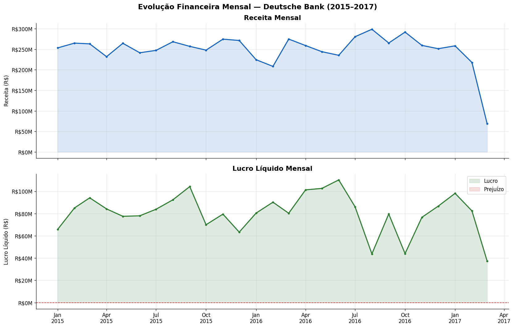
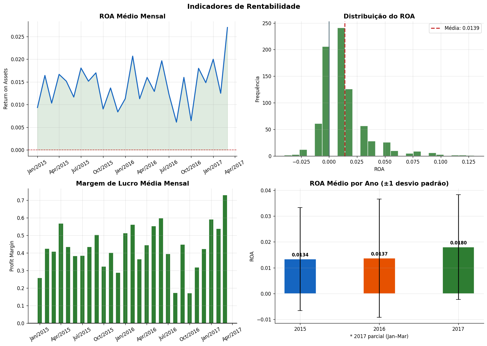
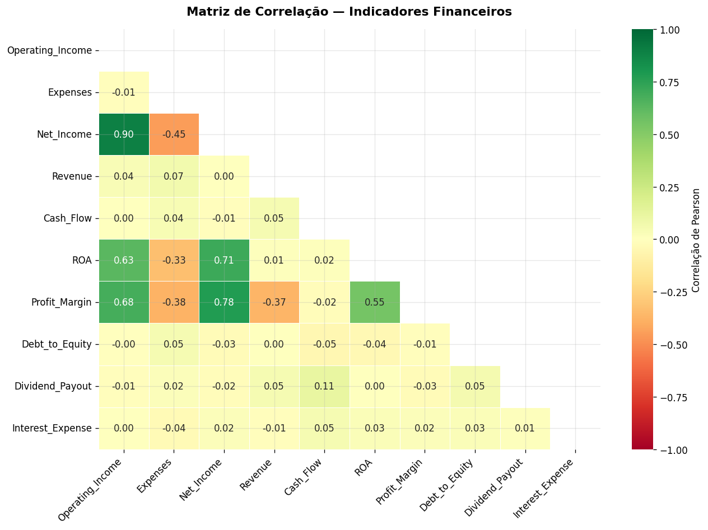

# Projeto 05 — Análise Financeira Deutsche Bank (2015–2017)

Análise de 800 registros diários de performance financeira do Deutsche Bank, cobrindo indicadores de rentabilidade, eficiência operacional, alavancagem e fluxo de caixa.

**Ferramentas:** Python · Pandas · Matplotlib · Seaborn

**Principais insights:**
- 19,5% dos registros com prejuízo operacional — custos fora de controle em 1 a cada 5 dias
- Debt-to-Equity médio de 5,53 com tendência crescente — alavancagem aumentando ano a ano
- Correlação de -0,45 entre despesas e lucro: controlar custos é o principal alavancador de resultado
- Receita e lucro têm correlação de 0,004 — crescer receita sem controlar custos não melhora resultado

## Visualizações

